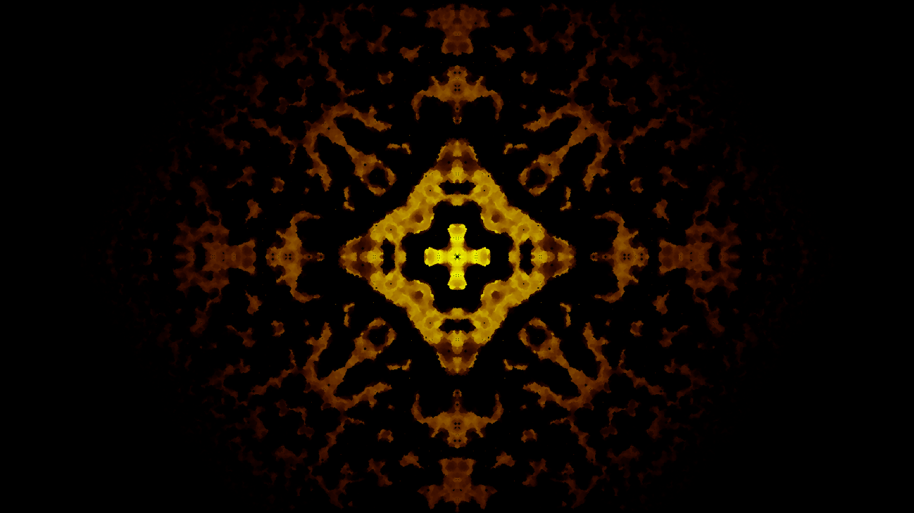

# Game of Life

This is an implementation of the [Day and Night](https://en.wikipedia.org/wiki/Day_and_Night_(cellular_automaton)) variant of [Conway's Game of Life](https://en.wikipedia.org/wiki/Conway%27s_Game_of_Life) using JavaFx 11.

You can run the application by executing `gradlew run` in the root directory of this project.

You can import the repository as an existing project into eclipse after executing `gradlew eclipse` in the root directory of this project.

## Example Image after 650 generations

